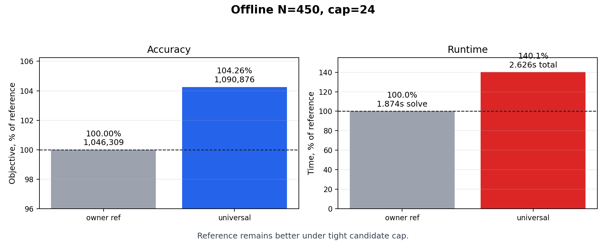
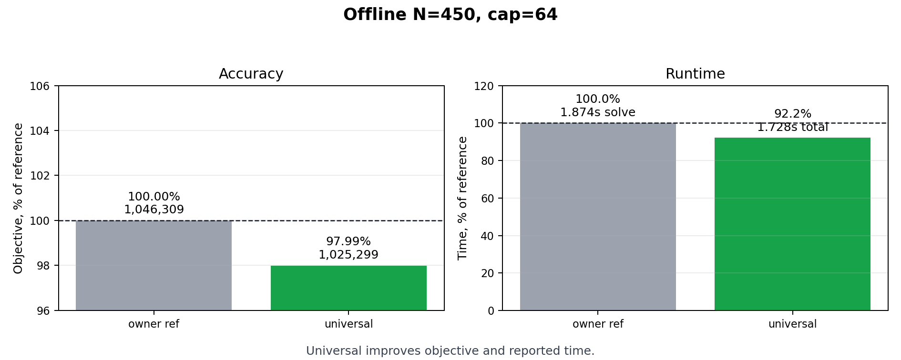
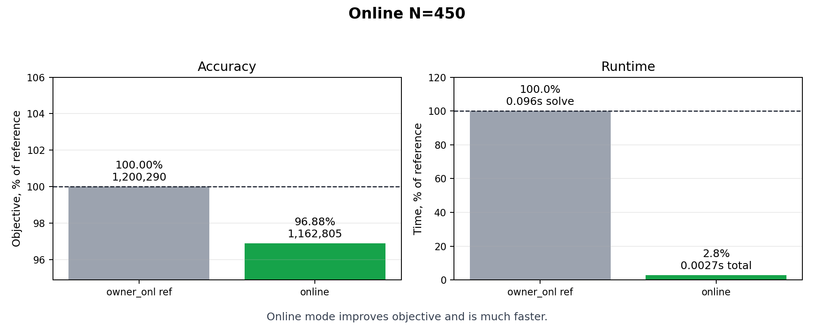
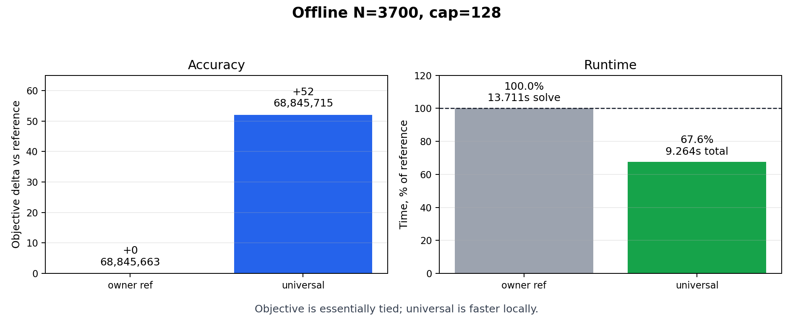
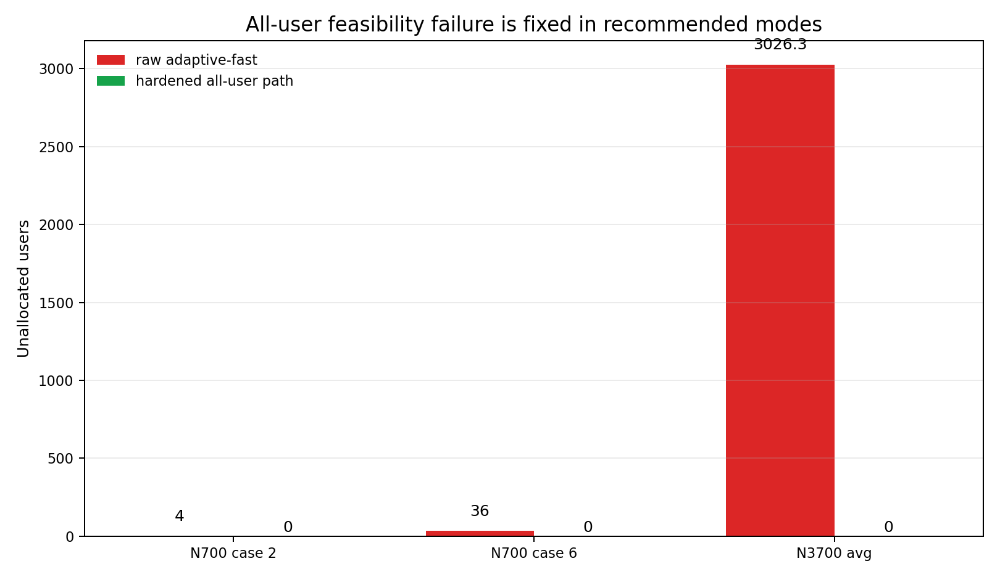

# Response To MOTOR Challenge Feedback

This document summarizes the changes made after the reviewer feedback. Lower objective values are better.

## Summary

| Reviewer point | Change in the solver | Current evidence |
|---|---|---|
| Start point was weak; more local-search rounds helped a lot. | Added exact all-user starts based on one-cell assignment/flow and a feature-driven `universal` controller. | More blind rounds are no longer the main improvement path; the exact start gives stable all-user incumbents. |
| Dense `N=3700` should allocate all users with period `320`. | Preserved one-cell fallback candidates under caps and added dense assignment-upgrade path. | `N=3700, cap=128`: `universal` has `0` unallocated users and average objective `68,845,715`. |
| Local search could reduce RB count but not add users back. | Added feasibility-first comparison: fewer unallocated users is prioritized before objective. | `N=700` cases 2 and 6 now finish with `0` unallocated users in hardened modes. |
| `prepare_ms` should count as execution time. | C++ output reports `prepare_ms`, `solve_ms`, and `total_ms`. | Current reported tables use total runtime unless explicitly marked otherwise. |

## 1. Offline Part

### 1.1 Better Starting Point

The feedback was correct: the old local search relied too heavily on the first
greedy schedule. Increasing the number of iterations improved the old result,
but that meant the start was in the wrong basin.

The current solver starts from a stronger mathematical structure:

```text
feasible time masks
-> exact one-cell assignment/flow when applicable
-> quality upgrades under collision checks
-> bounded local repair
```

For the review cases this is more reliable than simply increasing ALNS rounds.

### 1.2 Dense `N=3700`

The dense case has a simple capacity explanation. With 64 uplink slots and 58
RBs:

```text
64 * 58 = 3712 one-cell placements.
```

Thus 3700 users can fit with period 320 if all users have a feasible one-cell
option. The old capped candidate list could discard these fallback options. The
current implementation keeps them and dispatches dense all-one-cell instances to
the exact assignment-upgrade path.

Current generated 10-seed result:

| Mode | Avg objective | Avg RB | Avg unallocated | Avg total time |
|---|---:|---:|---:|---:|
| `adaptive-fast` | penalty-scale failure | 58.00 | about 3026 | 0.050 s |
| `universal` | 68,845,715 | 58.00 | 0.00 | 9.264 s |
| `online` | 69,320,399 | 58.00 | 0.00 | 0.021 s |

For the same generated 10-seed JSONL set, `universal` matches the optimistic
occupied-cell lower bound at `K=58` on every seed.

### 1.3 `N=700` Cases 2 And 6

The feedback noted cases where RB compression happened while users stayed
unallocated. The updated comparison rule prevents such final regressions once
an all-user incumbent has been found.

| Case | Mode | Objective | RB | Unallocated | Total time |
|---:|---|---:|---:|---:|---:|
| 2 | raw `adaptive-fast` | penalty-scale | 58 | 4 | 0.020 s |
| 2 | `assignment-upgrade` | 2,467,311 | 11 | 0 | 6.972 s |
| 6 | raw `adaptive-fast` | penalty-scale | 58 | 36 | 0.018 s |
| 6 | `assignment-upgrade` | 2,467,003 | 11 | 0 | 10.366 s |

## 2. Online Part

The online path is intentionally separate from the offline optimization modes.
It uses deterministic sparse capacity construction and avoids deep repair.

Visible reference comparison for `N=450`:

| Mode | Avg objective | Avg RB | Avg unallocated | Time |
|---|---:|---:|---:|---:|
| internal `owner_onl` reference | 1,200,290 | n/a | n/a | 0.096 s solve |
| `online`, current solver | 1,162,805 | 8.00 | 0.00 | 0.0027 s total |

So the current online mode is both lower objective and lower measured total time
on the visible `N=450` comparison.

## 3. Internal Reference Comparison

The internal reference rows were not rerun locally; they are visible reference
values from the feedback material. Reference times are solve-only where that is
all that was visible; current solver times are total `prepare_ms + solve_ms`.

| Scenario | Reference objective | Our mode | Our objective | Verdict |
|---|---:|---|---:|---|
| Offline `N=450, cap=24` | 1,046,309 | `universal` | 1,090,876 | Reference remains better under the tight cap. |
| Offline `N=450, cap=64` | 1,046,309 | `universal` | 1,025,299 | Current solver is better. |
| Online `N=450` | 1,200,290 | `online` | 1,162,805 | Current solver is better and faster. |
| Offline `N=3700, cap=128` | 68,845,663 | `universal` | 68,845,715 | Essentially tied; current solver is faster locally but not strictly lower. |

### 3.1 Offline `N=450, cap=24`

This is the tight-candidate case. The reference remains better on objective.



| Approach | Avg objective | Delta vs reference | Avg RB | Avg unallocated | Time | Time basis | Verdict |
|---|---:|---:|---:|---:|---:|---|---|
| internal `owner` reference | 1,046,309 | 0 | n/a | n/a | 1.874 s | solve only | Best objective. |
| `universal` | 1,090,876 | +44,567 (+4.26%) | 8.00 | 0.00 | 2.626 s | total | Feasible, but worse than reference under `cap=24`. |

### 3.2 Offline `N=450, cap=64`

With a wider candidate set, the universal solver finds a better objective.



| Approach | Avg objective | Delta vs reference | Avg RB | Avg unallocated | Time | Time basis | Verdict |
|---|---:|---:|---:|---:|---:|---|---|
| internal `owner` reference | 1,046,309 | 0 | n/a | n/a | 1.874 s | solve only | Strong reference. |
| `universal` | 1,025,299 | -21,010 (-2.01%) | 14.00 | 0.00 | 1.728 s | total | Better objective and lower reported time. |

### 3.3 Online `N=450`

The online path beats the visible online reference both by objective and time.



| Approach | Avg objective | Delta vs reference | Avg RB | Avg unallocated | Time | Time basis | Verdict |
|---|---:|---:|---:|---:|---:|---|---|
| internal `owner_onl` reference | 1,200,290 | 0 | n/a | n/a | 0.096 s | solve only | Reference online row. |
| `online` | 1,162,805 | -37,485 (-3.12%) | 8.00 | 0.00 | 0.0027 s | total | Better objective and about 35.6x faster. |

### 3.4 Offline `N=3700, cap=128`

The dense case is essentially tied by objective. The important improvement is
that all users are allocated, and the current solver is faster on the local
generated benchmark.



| Approach | Avg objective | Delta vs reference | Avg RB | Avg unallocated | Time | Time basis | Verdict |
|---|---:|---:|---:|---:|---:|---|---|
| internal `owner` reference | 68,845,663 | 0 | 58.00 | 0.00 | 13.711 s | solve only | Slightly lower objective. |
| `universal` | 68,845,715 | +52 (+0.00008%) | 58.00 | 0.00 | 9.264 s | total | Essentially tied by objective and about 1.48x faster. |

### 3.5 Feasibility Regression Cases

These rows answer the reviewer concern that local search could reduce RB count
while leaving users unallocated.



| Scenario | Raw failing mode | Raw unallocated | Hardened mode | Hardened unallocated | Hardened objective |
|---|---|---:|---|---:|---:|
| `N=700`, case 2 | `adaptive-fast` | 4 | `assignment-upgrade` | 0 | 2,467,311 |
| `N=700`, case 6 | `adaptive-fast` | 36 | `assignment-upgrade` | 0 | 2,467,003 |
| `N=3700`, average | `adaptive-fast` | about 3026 | `universal` | 0 | 68,845,715 |
