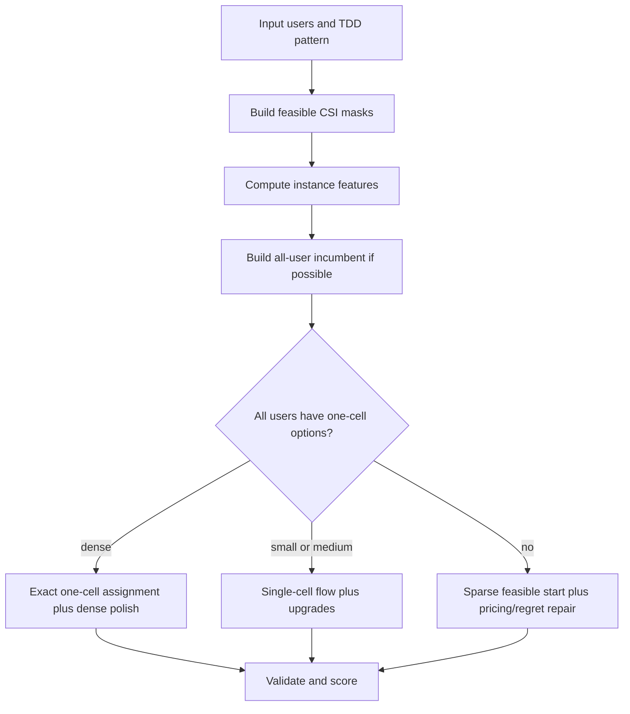

# Universal Solver For CSI Allocation On PUCCH

This document describes the current solver and the mathematical
reasoning behind it. The implementation is in `pucch_csi_fast.cpp`; the
recommended offline mode is:

```bash
./pucch_csi_fast --input-jsonl instances.jsonl --mode universal
```

## 1. Task

For each user `i`, choose one CSI configuration:

```text
(r_i, p_i, o_i)
```

where:

- `r_i` is the PUCCH resource block;
- `p_i` is the CSI reporting period;
- `o_i` is the CSI offset.

The 320-slot frame contains downlink and uplink slots according to the TDD
pattern. A CSI option is feasible only if all slots in its periodic mask are
uplink slots:

```text
T(p, o) = {o, o + p, o + 2p, ...} ∩ [0, 319].
```

The hard collision constraint is:

```text
for every RB r and slot t:
    at most one user may occupy (r, t).
```

The challenge objective is:

```text
minimize RB_used * sum_i q_i,
q_i = p_i + d_i,
```

where `d_i` is the CSI-SRS distance defined by the task statement.

## 2. Exact Model

A direct binary formulation uses variables:

```text
x_{i,r,a} = 1 if user i uses RB r and time option a.
```

Each scheduled user gets one option:

```text
sum_{r,a} x_{i,r,a} = 1.
```

Each RB-slot cell has capacity one:

```text
sum_{i,a: t in T_a} x_{i,r,a} <= 1.
```

This formulation is useful for CP-SAT and ILP checks on small instances, but it
is too large for the dense challenge cases. The production solver therefore
uses exact subproblems and bounded repairs instead of solving the full model at
once.

## 3. Universal Controller

The universal solver is a feature-driven controller, not one oversized local
search. It computes cheap instance features and chooses the branch that matches
the structure of the instance.



The key invariant is:

```text
if an all-user incumbent exists, final comparison is lexicographic:
    1. fewer unallocated users;
    2. lower challenge objective.
```

This prevents the failure mode where local search reduces RB count but leaves
schedulable users unallocated.

## 4. Instance Features

The controller uses:

| Feature | Meaning |
|---|---|
| `n` | number of users |
| `uplink_slots` | uplink slots in the 320-slot frame |
| `rb_cell_lb` | occupied-cell lower bound on required RB count |
| `pressure` | `rb_cell_lb / 58` |
| `one_cell_ratio` | fraction of users with a one-cell feasible option |
| `all_one_cell_feasible` | whether every user has such an option |
| candidate cap | how aggressively time options were pruned |

The features are intentionally cheap. They are used to select an exact kernel or
bounded heuristic branch, not to predict the final answer directly.

## 5. Dense Case Mathematics

The reviewer highlighted a dense `N=3700` case. With an `8:2` TDD pattern there
are 64 uplink slots in a 320-slot frame. With 58 RBs, the one-cell period-320
capacity is:

```text
64 * 58 = 3712 cells.
```

Therefore 3700 users can fit if every user has a feasible one-cell candidate.
The old candidate pruning could discard these long-period fallback candidates.
The current solver preserves them and then solves the assignment structure
directly.

After all users are placed with one-cell options, only 12 cells remain:

```text
3712 - 3700 = 12.
```

So at fixed 58 RBs, at most 12 users can be upgraded from period 320 to period
160 without opening another RB. The dense polish targets exactly these bounded
role swaps instead of performing broad random search.

## 6. Main Algorithmic Components

### One-Cell Assignment

When users have one-cell options, the solver solves a capacitated assignment:

```text
minimize sum_i q_{i,s}
subject to each user assigned to one slot s,
           load(s) <= K.
```

This is much stronger than greedy ordering because it chooses the global slot
distribution before RB placement.

### Single-Cell Upgrades

For sparse and medium cases, the solver starts from exact one-cell assignment
and tries bounded shorter-period upgrades. Each upgrade is accepted only if the
periodic mask remains collision-free and improves the objective under the
current RB budget.

### Dense Role Swaps

For saturated dense cases, the solver freezes most of the structure and checks
small exact exchanges. A typical exchange reassigns one period-160 bin and one
two-user period-320 bin by trying the exact feasible permutations and accepting
only improving moves.

### Pricing And Coloring Path

For cases where one-cell structure is weaker, the solver can use slot prices and
DSATUR-style coloring ideas: expensive or crowded slots receive higher prices,
then selected time masks are colored onto RBs with collision checks.

## 7. Lower-Bound Evidence

For large dense cases, full CP-SAT is too large. The practical certificate is an
optimistic occupied-cell multiple-choice knapsack lower bound:

```text
LB_K = min sum_i q_i(a_i)
       subject to sum_i |T(a_i)| <= K * uplink_slots.
```

This bound ignores detailed RB-slot collisions, so it is optimistic. If the
solver matches it on the same generated instances, no feasible solution can be
better within that relaxation.

On the generated dense `N=3700, cap=128` 10-seed benchmark, `universal` matches
this lower bound for every seed at `K=58`.

## 8. Benchmark Snapshot

Lower objective is better. Times include preparation and solving where available.

| Scenario | Mode | Avg objective | Avg RB | Avg unallocated | Avg time |
|---|---|---:|---:|---:|---:|
| `N=450, cap=64` | `universal` | 1,025,299 | 14.00 | 0.00 | 1.728 s |
| `N=450, cap=24` | `universal` | 1,090,876 | 8.00 | 0.00 | 2.626 s |
| `N=700, cap=128` | `universal` | 2,467,128 | 11.00 | 0.00 | 4.499 s |
| `N=3700, cap=128` | `universal` | 68,845,715 | 58.00 | 0.00 | 9.264 s |
| Online `N=450, cap=24` | `online` | 1,162,805 | 8.00 | 0.00 | 0.0027 s |

The visible internal-reference comparison is summarized in
`docs/feedback_response.md`.

## 10. References Behind The Method

The implementation combines standard operations research ideas:

- assignment and min-cost flow for structured one-cell placement;
- graph coloring and DSATUR-style ordering after time-mask selection;
- Lagrangian slot pricing for fixed-RB pressure;
- Large Neighborhood Search and Adaptive Large Neighborhood Search for bounded
  repair;
