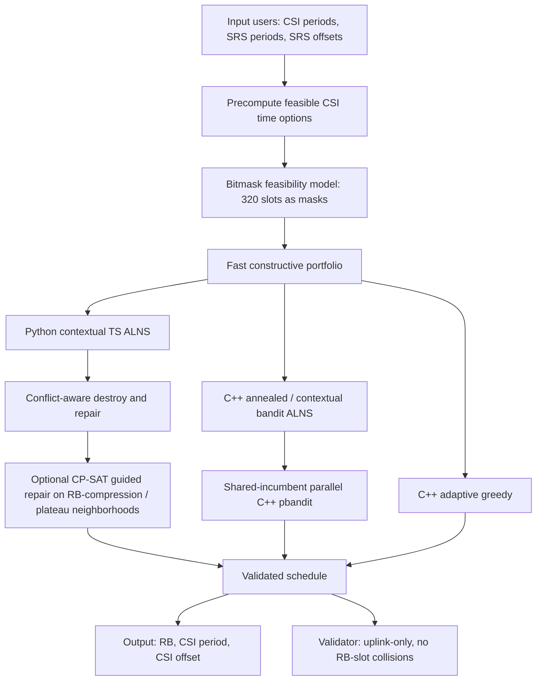
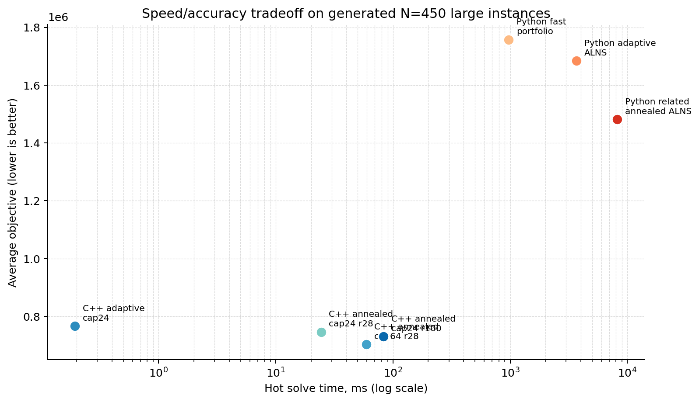

# PUCCH CSI Scheduling Solver: Proposed Solution and Evidence

## 1. Problem Summary

We solve offline CSI allocation on PUCCH for a TDD uplink grid. For each user
`i`, the solver must output:

```text
(RB_i, CSIperiod_i, CSIoffset_i)
```

The allocation is feasible only if:

- every CSI transmission is placed in an uplink slot;
- no two users occupy the same `(RB, slot)` pair;
- the selected CSI period belongs to the user's allowed period set;
- CSI timing remains aligned with the user's SRS resources through the task
  distance formula.

The task objective is:

```text
RB_used * sum_i(CSIperiod_i + distance_i)
```

Lower is better. We also support a lexicographic variant:

```text
minimize RB_used first, then minimize sum_i(CSIperiod_i + distance_i)
```

The lexicographic version is useful for claim-hardening because it separates RB
compression from timing quality.

## 2. Mathematical Model

Let `x_{i,r,p,o}` be a binary variable equal to 1 if user `i` is assigned to RB
`r` with CSI period `p` and offset `o`.

For every scheduled user:

```text
sum_{r,p,o} x_{i,r,p,o} = 1
```

For every RB-slot pair:

```text
sum_{i,p,o : slot in T(p,o)} x_{i,r,p,o} <= 1
```

where `T(p,o) = {o, o+p, o+2p, ...} ∩ [0,319]`.

A candidate `(p,o)` is allowed only if:

```text
T(p,o) subset of uplink slots
```

CSI/SRS distance follows the challenge statement's modulo-offset definition:

```text
if SRSperiod >= CSIperiod:
    distance = |CSIoffset - (SRSoffset mod CSIperiod)|
else:
    distance = min_k |CSIoffset - ((SRSoffset + k*SRSperiod) mod CSIperiod)|
```

For users with multiple SRS offsets, we take the minimum distance.

## 3. Proposed Solver Architecture

The final proposal is not a single algorithm. It is a speed/accuracy portfolio
with three practical tiers.



### Tier A: Real-Time C++ Adaptive Greedy

This is the fast path.

Main ideas:

- precompute feasible `(period, offset, mask, distance, quality)` options;
- represent 320 slots as five `uint64_t` words;
- evaluate only active RBs plus one representative empty RB;
- score candidate placement by timing quality plus an adaptive new-RB penalty.

Score:

```text
score = quality + adaptive_penalty(new RB)
adaptive_penalty = beta * (1 + active_RB_count / 5)
```

This path is suitable for runtime claims. It is not the best accuracy path.

### Tier B: C++ Annealed ALNS

This is the speed/quality middle path.

It starts from a small greedy portfolio and applies an Adaptive Large
Neighborhood Search loop:

1. choose a destroy operator;
2. remove a subset of users;
3. repair by random insertion or regret insertion;
4. accept the candidate if it improves the objective, or sometimes accept a
   worse move using simulated annealing;
5. update operator weights based on success.

Destroy operators:

- `random`;
- `worst-quality`;
- `crowded-rb`;
- `light-rb`;
- `blockers`;
- `related-time`;
- `evacuation-related`.

The two related-removal operators are the most domain-specific part:

- `related-time` removes users whose periodic masks overlap strongly, especially
  if they are on the same RB or have similar periods;
- `evacuation-related` targets a lightly used RB and removes users whose masks
  conflict with the RB's users, making whole-RB compression more likely.

This tier is much faster than Python ALNS and useful for batch/offline
improvement, but it does not yet match the best Python accuracy mode.

### Tier C: Python Related Annealed ALNS

This is the current best-quality solver.

It implements the same conceptual search as Tier B, but in a more flexible
Python prototype. It is slower but currently gives the best objective values on
generated large instances.

The Python accuracy path is useful for:

- offline optimization;
- validating new heuristics before porting to C++;
- producing stronger benchmark submissions if runtime is not constrained.

## 4. Exact and Proof-Oriented Components

We also implemented an OR-Tools CP-SAT fixed-RB model.

Purpose:

- solve small instances exactly;
- measure optimality gaps;
- calibrate whether heuristic claims are honest;
- test fixed-`K` compression hypotheses.

CP-SAT is too slow for large production instances, but it is important for
scientific grounding. For example, on `N=25, seed=1, medium`, fixed-K CP-SAT
proved an optimum of `3479`, while heuristic solutions remained above that.

## 5. References and How They Informed the Solver

### Large Neighborhood Search

Paul Shaw introduced the core idea of Large Neighborhood Search using constraint
programming and local search for vehicle routing problems. We use the same
principle: destroy a structured part of the solution and repair it under hard
constraints.

- Shaw, P. (1998). *Using Constraint Programming and Local Search Methods to
  Solve Vehicle Routing Problems*.
  [CORE](https://core.ac.uk/display/24476934),
  [PDF](https://citeseerx.ist.psu.edu/document?doi=9a4d69b0b44d06e2f38bb6086618f16263871d4f&repid=rep1&type=pdf)

### Adaptive Large Neighborhood Search

Ropke and Pisinger developed ALNS with multiple destroy/repair operators and
adaptive operator selection. This directly inspired our operator-weighted ALNS
loop.

- Ropke, S., & Pisinger, D. (2006). *An Adaptive Large Neighborhood Search
  Heuristic for the Pickup and Delivery Problem with Time Windows*.
  [DOI/info](https://dblp.org/rec/journals/transci/RopkeP06),
  [technical report PDF](https://di.ku.dk/forskning/Publikationer/tekniske_rapporter/tekniske-rapporter-2004/04-13.pdf)

### Learned/Adaptive Operator Selection

Recent work shows that learned or adaptive operator selection can improve ALNS
performance. We did not put a neural network in the runtime loop, but we used
the same design idea: maintain a portfolio of operators and reward those that
produce improvements.

- Johnn, S.-N., Darvariu, V.-A., Handl, J., & Kalcsics, J. (2024).
  *A Graph Reinforcement Learning Framework for Neural Adaptive Large
  Neighbourhood Search*. Computers & Operations Research.
  [ScienceDirect](https://www.sciencedirect.com/science/article/pii/S0305054824002636)

### CP-SAT for Exact Scheduling Checks

OR-Tools CP-SAT is used as a small-instance exact solver and proof tool. It is
not the runtime solver, but it helps measure optimality gaps and verify whether
RB compression is theoretically possible.

- Google OR-Tools CP-SAT scheduling documentation.
  [Scheduling recipes](https://github.com/google/or-tools/blob/stable/ortools/sat/docs/scheduling.md),
  [CP-SAT docs index](https://github.com/google/or-tools/blob/stable/ortools/sat/docs/README.md)

### Wireless Scheduling Context

Recent 5G NR scheduling literature supports hybrid scheduling approaches and
warns that direct AI/DRL approaches can suffer from high state dimensionality and
runtime overhead. That matches our design: learned/adaptive helpers are useful,
but feasibility remains deterministic.

- Pindi, N. R., & Velez, F. J. (2025). *Traffic Scheduling and Resource
  Allocation for Heterogeneous Services in 5G New Radio Networks: A Scoping
  Review*. [MDPI Smart Cities](https://www.mdpi.com/2624-6511/8/5/168)

## 5.1 Final Deep Research Pass: 2024-2026 Evidence

The final literature pass did not uncover a public paper that solves exactly
this challenge formulation: periodic CSI-on-PUCCH allocation with RB-slot
collision avoidance and CSI/SRS distance objective. The closest current work
falls into five buckets.

### Periodic Scheduling as Packing

Grus, Hanen, and Hanzalek (2024/2025) study periodic scheduling with harmonic
periods and show a bijection to a height-divisible 2D packing problem. They also
compare CP and ILP formulations and report that CP is stronger on difficult
instances.

Relevance to our solver:

- CSI periods are harmonic: `5, 10, 20, 40, 80, 160, 320`;
- each `(period, offset)` produces a repeating time mask;
- an RB is analogous to a packing bin/channel;
- CP-SAT exact checks are mathematically justified, not just a convenience.

Reference:

- Grus, J., Hanen, C., & Hanzalek, Z. (2024/2025).
  *Packing-Inspired Algorithms for Periodic Scheduling Problems with Harmonic
  Periods*. [arXiv](https://arxiv.org/abs/2410.14756)

### Control-Channel Scheduling as Conflict Graph Optimization

Recent PDCCH scheduling work formulates 5G control-channel allocation as a
Maximum Weighted Independent Set problem and argues that simple greedy
weight-to-degree heuristics can be attractive because of their
performance/complexity tradeoff.

Relevance to our solver:

- our `(user, RB, period, offset)` candidates also form a conflict graph;
- conflicts occur when two candidates reuse an `(RB, slot)` pair;
- greedy and local-search methods are appropriate when exact graph optimization
  is too slow.

Reference:

- Maggi, L., Valcarce Rial, A., Herzog, A., Kalyanasundaram, S., & Agrawal, R.
  (2024). *PDCCH Scheduling via Maximum Independent Set*.
  [paper summary/arXiv link](https://www.emergentmind.com/papers/2405.04283)

### Adaptive Operator Selection and Neighborhood Size

The strongest 2024-2026 ALNS trend is not "replace the solver with a neural
network." It is adaptive operator and neighborhood-size selection.

Examples:

- Graph RL for ALNS models operator choice as an MDP and learns operator
  policies from graph states.
- BALANCE uses a bi-level multi-armed bandit to select destroy heuristics and
  neighborhood sizes online, improving anytime multi-agent path finding.
- Q-learning ALNS variants in scheduling/logistics report that operator
  selection efficiency is a major contributor to quality.

Relevance to our solver:

- our weighted operator selection is a lightweight version of this trend;
- a next credible step would be Thompson-sampling or Q-learning over
  `(operator, repair mode, destroy size)`;
- the current related-removal operators can be treated as a learned/selected
  operator family rather than manually fixed.

References:

- Johnn, S.-N., Darvariu, V.-A., Handl, J., & Kalcsics, J. (2024).
  *A Graph Reinforcement Learning Framework for Neural Adaptive Large
  Neighbourhood Search*. [ScienceDirect](https://www.sciencedirect.com/science/article/pii/S0305054824002636)
- Phan, T., Huang, T., Dilkina, B., & Koenig, S. (2024).
  *Adaptive Anytime Multi-Agent Path Finding Using Bandit-Based Large
  Neighborhood Search*. [AAAI](https://ojs.aaai.org/index.php/AAAI/article/view/29701)
- *Integrated trucks assignment and scheduling problem with mixed service mode
  docks: A Q-learning based adaptive large neighborhood search algorithm*
  (2025). [ScienceDirect](https://www.sciencedirect.com/science/article/pii/S0377221725010033)

### CP-SAT and CP Optimizer for Scheduling

PyJobShop (2025) reports large-scale scheduling experiments over more than 9000
benchmark instances using OR-Tools CP-SAT and IBM CP Optimizer. The paper
concludes that OR-Tools remains highly competitive for several scheduling
classes while CP Optimizer can be stronger on some large/permutation problems.

Relevance to our solver:

- using OR-Tools CP-SAT for small proof cases is defensible;
- CP-SAT should not be advertised as the large-instance runtime engine;
- if exact proof becomes a priority, comparing CP-SAT with CP Optimizer or a
  specialized set-partitioning/column-generation formulation would be a serious
  next research step.

Reference:

- Lan, L., et al. (2025). *PyJobShop: Solving scheduling problems with
  constraint programming in Python*. [arXiv](https://arxiv.org/abs/2502.13483)

### 3GPP/ETSI CSI Collision Semantics

3GPP TS 38.214 defines CSI priority and collision behavior for overlapping CSI
reports. The standard discusses CSI report priority values and states that CSI
reports collide when time occupancy overlaps on the same carrier.

Relevance to our solver:

- our simplified challenge model treats collisions at `(RB, slot)` granularity;
- the real standard has richer symbol-level, carrier-level, and priority
  semantics;
- we should frame this as a challenge-specific scheduler prototype, not a full
  3GPP-complete PUCCH scheduler.

Reference:

- ETSI TS 138 214 V17.10.0 / 3GPP TS 38.214 Release 17.
  [ETSI PDF](https://www.etsi.org/deliver/etsi_ts/138200_138299/138214/17.10.00_60/ts_138214v171000p.pdf)

### Final Research Implications

| Research signal | Implication for our solution |
|---|---|
| Periodic scheduling maps naturally to packing | Our bitmask/RB packing model is mathematically well aligned. |
| CP often beats ILP on hard harmonic periodic scheduling | Keep CP-SAT/CP-style exact checks for proof and calibration. |
| Control-channel scheduling can be modeled as conflict graph optimization | Candidate conflict graph features could improve destroy selection. |
| Modern ALNS emphasizes adaptive operator and neighborhood-size choice | Add bandit/Q-learning over operator, repair mode, and destroy size. |
| Bandit LNS work reports gains from learning both operator and neighborhood size online | Treat destroy size as part of the action, not as a fixed constant. |
| Recent adaptive dynamic neighborhood work learns search scope from state | Use schedule contexts such as RB slack, crowding, and plateau state. |
| Standards include richer CSI priority/collision rules | Do not overclaim 3GPP completeness; state challenge-specific assumptions. |
| 5G scheduling literature favors hybrid/AI-assisted approaches | "Learned helper + deterministic feasibility solver" is the right framing. |

We tested several lightweight versions of the bandit/Q-learning idea after this
research pass.

The standalone `bandit-alns` method selects both `(operator, repair mode)` and
destroy size using adaptive weights. On generated `N=250`, `difficulty=large`,
`seeds=1,2,3`, it reached `478,932.7` average objective versus `459,483.0` for
the existing related annealed ALNS, and was slower (`4.18 s` versus `3.38 s`).
The likely reason is sparse learning: the bandit has too few rounds to reliably
learn over a larger action space.

The more successful variant is `ucb-polish-alns`: first run related annealed
ALNS, then apply a short UCB-guided polish over a small, biased set of
operator/repair/size choices. This makes the bandit solve a narrower problem:
improve a strong incumbent rather than discover the whole search strategy from
scratch. On generated `N=250`, it slightly improved average objective from
`459,483.0` to `459,023.0`. On generated `N=450`, it improved average objective
from `1,481,212.7` to `1,468,950.0` with the same average RB count (`34.67`),
but increased runtime from about `6.87 s` to `10.18 s`.

Conclusion: bandit selection is useful as a polish layer, but the hand-tuned
related annealed ALNS remains the cleaner default accuracy mode.

We then tested a contextual UCB polish. Instead of learning one global score for
each destroy/repair move, the solver first classifies the incumbent schedule
into one of four contexts:

- `rb-compression`: current RB usage is above a simple capacity lower bound or
  there are lightly loaded RBs worth trying to evacuate;
- `crowding`: the load distribution across active RBs is imbalanced;
- `quality-polish`: RB count is stable and the search should reduce
  CSI-period/distance cost;
- `plateau`: the search has not improved for several rounds and should try a
  larger neighborhood.

Each context has its own UCB statistics over `(destroy operator, repair mode,
neighborhood size)` arms. This matters because the same operator can have
opposite value in different states: for example, `evacuation-related` is useful
when RB slack exists, while `related-time` is usually better after RB count is
already compact. On generated `N=250`, `difficulty=large`, `seeds=1,2,3`, the
contextual version improved average objective from `459,023.0` for plain
`ucb-polish-alns` to `458,563.0`. On generated `N=450`, it improved from
`1,468,950.0` to `1,457,008.0`, at the cost of additional runtime. In
lexicographic RB-first mode, however, the plain UCB polish can still be better
because it found a lower-RB solution on one seed. Therefore contextual UCB is
best positioned as the strongest product-objective accuracy mode, not as the
default strict RB-minimization mode.

A second optimization round replaced UCB with contextual Thompson-style
sampling and reduced hot-loop overhead. The motivation comes from BALANCE,
which reports strong behavior from bandit-based LNS with adaptive neighborhood
sizes, and from recent adaptive dynamic neighborhood search papers that learn
both the heuristic and the search scope from the current state. Our lightweight
version keeps the deterministic repair solver, but changes the controller:

- sample an arm from the context-specific posterior-like score instead of using
  a deterministic UCB score;
- use fewer polish rounds and fewer random repair attempts;
- compute compact schedule statistics in the hot loop instead of rebuilding the
  full occupancy matrix for every reward calculation;
- stop early after repeated non-improving polish rounds.

This `contextual-ts-bandit-alns` mode is slightly less accurate than full
contextual UCB on `N=450`, but much faster. On generated `N=250`, it improved
both quality and speed: `458,098.7` average objective versus `458,563.0` for
contextual UCB, while reducing runtime from about `5.05 s` to `3.79 s`. On
generated `N=450`, it reached `1,457,646.0` versus `1,457,008.0` for contextual
UCB, while reducing runtime from about `13.74 s` to `9.56 s`.

Research references for this round:

- Cai, Kadioglu, and Dilkina, "Balans: Multi-Armed Bandits-based Adaptive Large
  Neighborhood Search for Mixed-Integer Programming Problems," IJCAI 2025.
- Phan et al., "Adaptive Anytime Multi-Agent Path Finding Using Bandit-Based
  Large Neighborhood Search," AAAI 2024.
- Yilmaz, Cai, Kadioglu, and Dilkina, "ParBalans: Parallel Multi-Armed
  Bandits-based Adaptive Large Neighborhood Search," 2025.
- Wang et al., "ADNS: An adaptive dynamic neighborhood search method guided by
  joint learning heuristics and corresponding hyperparameters," Applied Soft
  Computing 2025.
- Chung, Lee, and Tsang, "Neural combinatorial optimization with reinforcement
  learning in industrial engineering: a survey," Artificial Intelligence Review
  2025.

The most defensible final positioning is therefore:

> The proposed method is a deterministic feasibility-safe hybrid scheduler,
> combining periodic-packing heuristics, ALNS-style RB compression, and exact
> CP-SAT calibration. It follows current trends in scheduling optimization:
> use exact solvers for small proof cases, adaptive neighborhoods for quality,
> and low-level bitset heuristics for speed.

## 6. Accuracy Results

Generated task-style instances:

- TDD pattern: `(8 DL : 2 UL)`;
- `L = 320`, `R = 58`;
- difficulty: `large`;
- seeds: `1,2,3`;
- objective: product objective unless stated otherwise.

### Product Objective

| Method | N=50 avg obj | N=250 avg obj | N=450 avg obj | Notes |
|---|---:|---:|---:|---|
| Baseline greedy | 35,151.3 | 689,711.3 | 2,017,588.0 | Distance-first baseline style |
| Adaptive greedy | 23,106.7 | 537,330.3 | 1,760,739.3 | Fast Python greedy |
| Fast portfolio | 21,308.3 | 534,854.7 | 1,757,618.7 | Python greedy portfolio |
| Python adaptive ALNS | 20,431.7 | 497,653.0 | 1,684,207.7 | Related operators enabled |
| Python related annealed ALNS | 20,110.0 | 459,483.0 | 1,481,212.7 | Strong offline baseline |
| Python contextual UCB polish | not rerun | 458,563.0 | 1,457,008.0 | Best previous product objective |
| Python contextual TS + conflict-aware repair | 20,695.0 on seed 1 | 457,677.0 | not rerun | Current best Python `N=250` accuracy |
| Python contextual TS + quick CP-SAT repair | 19,687.5 on seeds 1-2 | 439,362.0 on seed 1 | not rerun | Optional; expensive and instance-dependent |

### Lexicographic RB-First Objective

| Method | N=250 avg obj | N=250 avg RB | N=250 avg quality |
|---|---:|---:|---:|
| Fast portfolio | 533,696.0 | 22.00 | 24,318.0 |
| Python adaptive ALNS | 502,815.0 | 21.67 | 23,280.3 |
| Python related annealed ALNS | 465,701.7 | 19.33 | 24,195.3 |
| Python UCB polish ALNS | 462,833.3 | 19.00 | 24,442.7 |
| Python contextual UCB polish | 460,624.3 | 19.33 | 23,946.0 |
| Python contextual TS polish | 454,892.3 | 19.33 | 23,637.7 |

The lexicographic result is important: related annealed ALNS does not merely
improve timing quality; it also finds more compact RB packings. For strict
RB-first selection, `ucb-polish-alns` remains the conservative choice because
it reached the lowest average RB count in this small sweep. For product
objective or quality-focused reporting, contextual TS is better.

## 7. Runtime Results

### Python Methods

Average hot solve times on generated `N=50,250,450`, `difficulty=large`,
`seeds=1,2,3`:

| Method | N=50 time | N=250 time | N=450 time | Role |
|---|---:|---:|---:|---|
| Python fast portfolio | ~63 ms | ~382 ms | ~1.15 s | quick Python baseline |
| Python adaptive ALNS | ~244 ms | ~1.41 s | ~3.68 s | offline refinement |
| Python related annealed ALNS | ~407 ms | ~3.17 s | ~8.18 s | best accuracy |
| Python contextual UCB polish | not rerun | ~5.18 s | ~15.47 s | best product objective |
| Python contextual TS polish | not rerun | ~3.79 s | ~9.56 s | faster near-best product objective |

### C++ Methods

The C++ kernel was tested on the same exported generated instances.

| Method | Cap | Rounds | Avg hot solve time | Notes |
|---|---:|---:|---:|---|
| C++ adaptive | 24 | 0 | 0.19 ms | real-time path |
| C++ annealed ALNS | 24 | 28 | 24.4 ms | middle speed/quality |
| C++ annealed ALNS | 24 | 100 | 83.0 ms | stronger middle path |
| C++ annealed ALNS | 64 | 28 | 59.5 ms | better candidate set |

For `N=450`, C++ annealed ALNS with `cap=64, rounds=28` ran around
`122-177 ms` per case, far faster than Python ALNS but currently less accurate.

### C++ Bandit Mode

A C++ contextual Thompson-bandit polish was added as `--mode bandit`. It uses
the same high-level idea as the Python contextual TS mode, but keeps the
controller small enough for the C++ hot path:

- start from C++ annealed ALNS;
- classify the schedule into RB-compression, crowding, quality-polish, or
  plateau contexts;
- sample a context-specific arm containing destroy operator, repair mode, and
  neighborhood size;
- update the arm reward from objective gain, RB reduction, and quality
  reduction.

The first C++ bandit version used full regret repair inside the polish loop.
The optimized version uses an approximate regret order: compute regret scores
once for the removed set, sort users by that score, and then greedily reinsert
in that order. This avoids the quadratic re-scoring loop used by full regret
repair. The destroy step also now uses `partial_sort` for top-k removals, since
only the selected neighborhood is needed.

The next speed pass added repair-candidate pruning. The initial C++ search can
still use a larger candidate cap such as `64`, but bandit polish now considers
only the top `16` time options per removed user. This follows the practical LNS
pattern from recent work: keep a strong incumbent and make the repeated repair
operator cheap, since most polish iterations only need high-quality local
alternatives rather than the full candidate list.

On generated `N=250,450`, `difficulty=large`, `seeds=1,2,3`:

| C++ Method | Cap | N=250 avg obj | N=450 avg obj | Avg solve time |
|---|---:|---:|---:|---:|
| Adaptive | 24 | 540,901.7 | 1,735,750.0 | 0.28 ms |
| Annealed ALNS | 24 | 520,869.3 | 1,671,005.3 | 48.73 ms |
| Bandit ALNS, full regret | 24 | 519,968.0 | 1,668,690.7 | 62.48 ms |
| Bandit ALNS, fast regret | 24 | 519,912.0 | 1,668,672.3 | 50.09 ms |
| Annealed ALNS, partial destroy | 24 | 513,536.0 | 1,687,522.0 | ~44.6 ms |
| Bandit ALNS, fast regret + partial destroy | 24 | 516,382.0 | 1,681,934.3 | ~47.1 ms |
| Bandit ALNS, repair cap 16 | 24 | 514,446.0 | 1,681,371.7 | ~45-69 ms |
| Annealed ALNS, partial destroy | 64 | 501,536.3 | 1,602,786.7 | ~94-131 ms |
| Bandit ALNS, fast regret + partial destroy | 64 | 500,178.3 | 1,599,216.7 | ~100-115 ms |
| Bandit ALNS, repair cap 16 | 64 | 499,722.3 | 1,589,545.3 | ~96-133 ms |
| Independent parallel bandit | 64 | not split | not split | avg obj 1,032,232, ~158 ms |
| Shared-incumbent parallel bandit | 64 | not split | not split | avg obj 1,030,491, ~129 ms |

The optimized C++ bandit is therefore a better speed/quality middle tier than
the first C++ bandit version. With `cap=64`, total average objective across the
six generated cases improved from `1,073,667` in the first bandit version to
`1,044,633` after repair-candidate pruning. Runtime also fell from the first
version's roughly `164.6 ms` to roughly `100-130 ms` in sequential runs on this
laptop. With `cap=24`, the repair cap gave a smaller quality improvement and
kept runtime close to annealed ALNS. For stronger quality, prefer `cap=64`; for
a tighter runtime budget, prefer `cap=24`.

Python contextual TS remains stronger in objective quality, while optimized C++
bandit is far faster and now sits close to C++ annealed runtime.

The latest parallel C++ version uses a shared-incumbent pattern. It first runs
diverse worker searches, selects the best incumbent, then launches a second
short polish wave from that shared incumbent. On the six generated
`N=250,450` cases, this improved over the independent parallel portfolio
(`1,030,491` versus `1,032,232` average objective) while also reducing observed
solve time in the sequential benchmark run.

### CP-SAT Guided Plateau/RB-Compression Repair

The Python solver now includes `contextual-ts-cpsat`, which runs contextual
Thompson ALNS first and then calls CP-SAT on selected hard neighborhoods:

- `evacuation-related` / `light-rb` neighborhoods try `K-1` and `K` RB budgets;
- `conflict-graph` and `related-time` neighborhoods repair high-pressure or
  plateau-like subsets at the current RB budget;
- only the removed users are reoptimized exactly while the rest of the schedule
  remains fixed.

This is useful as a deep offline pass, but it is not the new default. With a
larger CP-SAT budget, a small `N=50`, two-seed sample improved from `19,687.5`
average objective to `18,567.5` by reducing average RB count from `5.0` to
`4.5`, but took about `14.7 s`. With the current quick budget, `N=250`, seed 1
matched contextual TS (`439,362`) and took about `19.1 s`. Therefore CP-SAT
repair is best positioned as an optional exact neighborhood repair for small
or final-offline cases, not as the everyday accuracy mode.

## 8. Speed/Accuracy Plot

The plot below shows the Pareto-style tradeoff on generated `N=450` large
instances. Lower objective and lower time are both better.



## 9. Final Research Synthesis

This final pass looked across four adjacent literatures: 5G/NR control-channel
scheduling, exact scheduling/CP methods, graph/conflict formulations, and
modern adaptive LNS.

### 5G NR and Control-Channel Scheduling

The most directly relevant standards source remains 3GPP TS 38.214. It defines
CSI reporting on PUCCH and CSI priority/collision behavior, but real NR
scheduling has richer details than the challenge model: symbol-level resources,
PUCCH formats, multiple serving cells, priorities, code-rate constraints, HARQ,
and PUSCH/PUCCH interactions. This supports our current wording: the solver is
a challenge-specific CSI-on-PUCCH allocation prototype, not a full 3GPP
scheduler.

Recent 5G scheduling surveys still emphasize heterogeneous-service scheduling,
RAN slicing, uplink resource allocation, and AI-assisted scheduling. These
papers mostly work at broader traffic/RB/slice levels rather than periodic CSI
offset packing, but the trend is clear: practical schedulers are usually hybrid,
combining deterministic feasibility logic with learned or adaptive ranking
components.

Useful references:

- ETSI / 3GPP TS 38.214, "NR; Physical layer procedures for data."
  [Release 16 PDF](https://www.etsi.org/deliver/etsi_ts/138200_138299/138214/16.15.00_60/ts_138214v161500p.pdf)
  and [Release 19 catalogue entry](https://standards.iteh.ai/catalog/standards/etsi/c4fb6fe5-2601-4a0f-b70b-415e9264acf2/etsi-ts-138-214-v19-1-0-2025-10).
- Pindi and Velez, "Traffic Scheduling and Resource Allocation for
  Heterogeneous Services in 5G New Radio Networks: A Scoping Review," Smart
  Cities 2025. [MDPI](https://www.mdpi.com/2624-6511/8/5/168)
- "Resource Allocation for Heterogeneous Services in Uplink 5G Networks via
  Deep Reinforcement Learning," CCDC 2025. [CoLab](https://colab.ws/articles/10.1109%2Fccdc65474.2025.11091007)

### Conflict Graphs and Control-Channel Assignment

The closest modern control-channel optimization paper found is PDCCH scheduling
via Maximum Weighted Independent Set. It is not PUCCH CSI scheduling, but the
modeling lesson transfers well: build a graph where candidate assignments are
vertices and collisions/conflicts are edges, then select a high-value compatible
set. For our problem, a full conflict graph would contain candidate
`(user, RB, period, offset)` assignments with edges for same-user alternatives
and RB-slot collisions. Exact MWIS is too heavy at challenge scale, but graph
features are useful for heuristics: degree, weight-to-degree ratio, conflict
count by RB, and candidate blocking score.

This supports our "blockers" and "crowding" destroy operators, and suggests a
future improvement: compute approximate candidate-degree features for removed
users and use them in regret insertion or contextual bandit state.

Useful reference:

- Maggi et al., "PDCCH Scheduling via Maximum Independent Set," 2024.
  [arXiv](https://arxiv.org/abs/2405.04283)

### Exact, CP-SAT, SAT, and Periodic Scheduling

Periodic scheduling with harmonic periods remains a natural fit for
constraint-programming and SAT-style models. The recent periodic-chain
scheduling work is especially relevant because it treats harmonic periods and
dedicated resources, then warm-starts local search from a CP model. That is very
close in spirit to our CP-SAT-guided LNS and fixed-RB calibration: exact solvers
are best used for small proof cases or as a repair/calibration module, not as
the whole large-instance engine.

The MaxSAT and CP-SAT scheduling literature also reinforces a point important
for claims: proving optimality at full scale is expensive, but exact methods
can provide lower bounds, infeasibility checks under fixed RB budgets, and
optimality gaps on small/medium cases.

Useful references:

- "Periodic chains scheduling on dedicated resources: A crucial problem in
  time-sensitive networks," Computers & Operations Research 2025.
  [ScienceDirect](https://www.sciencedirect.com/science/article/pii/S0305054825001005)
- "Optimization of Timed Petri Nets using CP-SAT," IFAC-PapersOnLine 2024.
  [ScienceDirect](https://www.sciencedirect.com/science/article/abs/pii/S2405896324000946)
- "From Scalable SAT to MaxSAT: Massively Parallel Solution Improving Search,"
  SOCS 2025. [AAAI](https://ojs.aaai.org/index.php/SOCS/article/view/35984)
- "Large Neighborhood Prioritized Search for Combinatorial Optimization with
  Answer Set Programming," KR 2024. [PDF](https://www.cs.uni-potsdam.de/wv/publications/DBLP_conf/kr/SugimoriINSSTB24.pdf)

### Adaptive LNS, Bandits, and Search Scope

The strongest algorithmic signal is from online adaptive LNS. BALANCE adapts
both destroy heuristic and neighborhood size for MAPF and reports Thompson
Sampling as particularly strong. Balans applies multi-armed-bandit ALNS to MIP
without offline training. ParBalans then studies parallelizing the same idea.
ADNS learns both heuristic and hyperparameters, again pointing toward joint
operator/scope adaptation.

These papers support the design choices we ended with:

- use online bandits rather than requiring an offline trained model;
- make neighborhood size part of the action;
- keep separate schedule contexts, because an operator that is useful during RB
  evacuation may be poor during quality polishing;
- use Thompson-style exploration for the polish phase;
- prune repeated repair candidate lists for speed.

Useful references:

- Phan et al., "Adaptive Anytime Multi-Agent Path Finding Using Bandit-Based
  Large Neighborhood Search," AAAI 2024. [AAAI](https://ojs.aaai.org/index.php/AAAI/article/view/29701)
- Cai, Kadioglu, and Dilkina, "Balans: Multi-Armed Bandits-based Adaptive Large
  Neighborhood Search for Mixed-Integer Programming Problems," IJCAI 2025.
  [IJCAI](https://www.ijcai.org/proceedings/2025/286)
- Yilmaz et al., "ParBalans: Parallel Multi-Armed Bandits-based Adaptive Large
  Neighborhood Search," 2025. [arXiv](https://arxiv.org/abs/2508.06736)
- Wang et al., "ADNS: An adaptive dynamic neighborhood search method guided by
  joint learning heuristics and corresponding hyperparameters," Applied Soft
  Computing 2025. [ScienceDirect](https://www.sciencedirect.com/science/article/pii/S1568494625005915)
- "Adaptive large neighborhood search for mixed integer programming,"
  Mathematical Programming Computation 2021. [Springer](https://link.springer.com/article/10.1007/s12532-021-00209-7)

### What This Means for Our Final Method

The best-supported final method is a portfolio, not one monolithic solver:

- exact CP-SAT/fixed-RB modes for proof, infeasibility checks, and gap
  calibration on small or medium instances;
- fast C++ adaptive/annealed/bandit modes for runtime-constrained scheduling;
- Python contextual Thompson/UCB ALNS for offline best-quality sweeps;
- RB-evacuation and conflict/blocker destroy operators as domain-specific
  neighborhoods;
- repair-candidate pruning as a practical speed tactic.

### Implemented After Final Research

The research-backed improvement list was converted into implementation hooks:

- conflict-graph features:
  Python and C++ now include a `conflict-graph` destroy operator. It scores
  scheduled users by time-slot pressure, RB load, and quality, approximating
  the candidate-degree idea from conflict-graph control-channel scheduling.
  Python also includes `conflict-aware` repair, which penalizes placements on
  high-pressure slots during regret reinsertion.
- parallel C++ bandit polish:
  C++ supports `--mode pbandit` / `--mode parallel-bandit` with `--workers`.
  Workers first explore diverse contextual bandit seeds, then share the best
  incumbent into a second polish wave. The older independent portfolio remains
  available as `--mode ipbandit`.
- fixed-RB CP-SAT lower-bound reporting:
  Python now supports `--cpsat-lower-bound`. It reports capacity lower bound,
  fixed-RB CP-SAT statuses, first feasible RB count, and certified infeasible
  RB budgets when the solver proves them.
- per-instance bandit priors:
  Python and C++ adjust contextual bandit priors from cheap instance features:
  number of users, average feasible option count, and a simple RB-capacity
  lower bound.
- full 3GPP details:
  not added, because the current challenge instances do not expose PUCCH format,
  symbol-level, serving-cell, HARQ, or PUSCH-interaction fields.

Smoke-test examples:

```bash
python3 pucch_csi.py --cpsat-lower-bound --exact-n 8 --exact-seed 1 \
  --difficulty medium --cpsat-time 0.5 --cpsat-max-rb 8

c++ -std=c++17 -O3 -march=native pucch_csi_fast.cpp -o /tmp/pucch_csi_fast
/tmp/pucch_csi_fast --n 50 --seeds 1 --mode pbandit --workers 2 --cap 24 --rounds 8
```

The research does not support claiming global optimality on large challenge
instances. It does support claiming a modern hybrid approach: deterministic
feasibility, bitset periodic packing, CP calibration, adaptive LNS, online
bandit control, and speed/accuracy tiers.

### Remaining Research-Backed Improvements

1. Upgrade the conflict-graph approximation:
   compute actual candidate degrees and WDR-style scores over the best
   `(user, RB, period, offset)` candidates instead of using only time-slot
   pressure.
2. Improve parallel C++ bandit merging:
   share incumbents or arm statistics across workers instead of only selecting
   the best final worker result.
3. Expand fixed-RB proof reporting:
   cache CP-SAT models by RB budget and report product-objective gaps alongside
   RB-count lower bounds.
4. Learn stronger per-instance policy priors:
   fit lightweight priors from benchmark logs rather than hand-coded feature
   thresholds.
5. Expand challenge-realistic constraints only if required:
   PUCCH format, symbol-level occupancy, priority rules, serving-cell groups,
   and PUSCH interactions are standards-relevant but outside the simplified
   challenge model.

## 10. Current Claims We Can Defend

We can defensibly claim:

- The solver always validates hard feasibility: uplink-only CSI and no
  `(RB, slot)` collisions.
- The adaptive/portfolio heuristics strongly improve over the baseline greedy
  on generated task-style instances.
- Python contextual UCB/TS polish gives the best product-objective accuracy
  found so far; TS is the better speed/quality default.
- C++ adaptive is the only current mode that credibly targets sub-millisecond
  runtime.
- C++ annealed ALNS creates a useful middle tier: much faster than Python ALNS,
  much stronger than simple greedy in some settings, but not yet the best
  quality mode.
- CP-SAT can prove small cases and show nonzero optimality gaps; therefore we
  should not claim global optimality or that the challenge is fully solved.

## 11. Recommended Presentation

For a paper or challenge report, present the solver as a portfolio:

| Mode | Recommended Use | Claim |
|---|---|---|
| C++ adaptive | real-time scheduling prototype | fastest feasible solution |
| C++ annealed ALNS | batch scheduler with tight runtime budget | speed/quality compromise |
| C++ contextual bandit ALNS | batch scheduler with moderate runtime budget | slightly better than C++ annealed |
| Python contextual TS polish | offline benchmark-quality optimization | best speed/quality Python accuracy mode |
| Python contextual UCB polish | final offline quality sweep | slightly stronger product objective, slower |
| CP-SAT fixed-K | small proof cases | optimality-gap calibration |

The strongest honest framing is not "one solver solves everything." It is:

> We provide a deterministic feasibility-safe scheduling framework with
> speed/accuracy tiers, exact small-instance calibration, and ALNS-based
> RB-compression refinements that substantially improve over baseline greedy
> scheduling on generated challenge-style instances.
